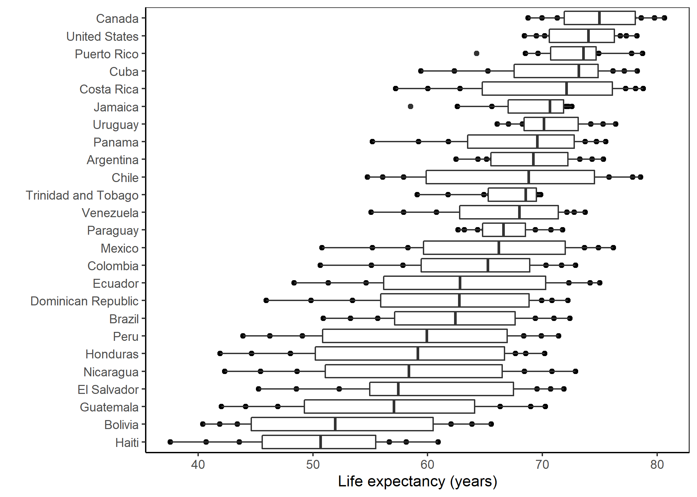

[Instructions are found here](https://stat545.stat.ubc.ca/evaluation/hw05/hw05/)

```{r , warning=FALSE,echo=FALSE}
suppressPackageStartupMessages(library(tidyverse)) 
suppressPackageStartupMessages(library(gapminder))
suppressPackageStartupMessages(library(here))
suppressPackageStartupMessages(library(gridExtra))
```

## Exercise 1: Explain the value of the here::here package
The advantage of using the here package is that its easier to share your code with others. I've been sent code from a Mac user (I have a PC) and had to spend a lot of time figuring out why their code wouldn't run on my computer. [Malcolm Barrett](https://malco.io/2018/11/05/why-should-i-use-the-here-package-when-i-m-already-using-projects/) also points out that if you move a file, here will still be able to find it, which is a huge plus. Essentially, the here package is a much more efficient way to read in data because it works across different platforms without needing to change any code; its seperate from our file organizations (so they can be moved around without fear of affecting pathways); and it makes it a lot easier to send code to people who work on other computers (so they don't have to change the pathway that only works on my computer).

## Exercise 2: Factor management
Task: choose a data set and a variable to explore

```{r}
is.factor(gapminder$continent) # is continent a factor? yes
is.factor(gapminder$country) # is country a factor? yes
nlevels(gapminder$continent) # 5 levels
nrow(gapminder) # how many rows in original data set? 1704
```

##### Elaboration for the gapminder data set
1. _Drop Oceania._ Filter the Gapminder data to remove observations associated with the continent of Oceania. Additionally, remove unused factor levels. Provide concrete information on the data before and after removing these rows and Oceania; address the number of rows and the levels of the affected factors.

Dropping observations:
```{r}
gap2 <- 
  gapminder %>% 
  filter(continent != "Oceania")
nrow(gap2) #now theres 1680 rows
```
But theres still 5 levels:
```{r}
levels(gap2$continent)
```

So let's remove Oceania as a factor level:
```{r}
gap2 <- 
  gapminder %>% 
  filter(continent != "Oceania") %>% 
  droplevels() #dropping oceania as a level
levels(gap2$continent) #now there's 4!
```

2. _Reorder the levels of country or continent._ Use the forcats package to change the order of the factor levels, based on summarized information of one of the quantitative variables. Consider experimenting with a summary statistic beyond the most basic choice of the mean/median. Use the forcats package in the tidyverse for this, rather than the baseR function as.factor.

- Comparing the results of arrange on the original and re-leveled factor.

```{r}
# order before:
levels(gap2$continent)
```

```{r}
# order after: 
fct_reorder(gap2$continent, gap2$lifeExp) %>% 
  levels() %>% head()
```

Using my gap2 dataset, I will reorder the factors based on the median life expectancy 

```{r}
# Original factor order:
gap2 %>% 
  filter(year == "2007") %>% 
  ggplot()+
  geom_boxplot(aes(continent, lifeExp)) + 
  theme_bw() +
  xlab("Continent") +
  ylab("Life expectancy (years)") +
  ggtitle("Life expectancy per continent in 2007, unordered")
  
```

```{r}
# reordered factors based on median lifeExp :
gap2 %>% 
  filter(year == "2007") %>% 
  ggplot()+
  geom_boxplot(aes(fct_reorder(continent, lifeExp), lifeExp)) + #reordering by median lifeexp
  theme_bw() +
  xlab("Continent") +
  ylab("Life expectancy (years)")+
  ggtitle("Life expectancy per continent in 2007, ordered")
```

The graph is now ordered in order of median life expectancy (only 2 factors ended up moving)

## Exercise 3:  File input/output (I/O)
Task: Experiment with write/read_csv() 

Like we did in class, I will make a new data table of a subset of the gapminder data:

```{r}
am_data <- 
  gapminder %>% 
  filter(continent == "Americas") %>% 
  group_by(country) %>% 
  summarize(mean(gdpPercap), mean(lifeExp))
am_data
```

write to a file:
```{r}
write_csv(am_data,
         here("am_data.csv"))
```
upload again:
```{r, message = FALSE}
am_data2 <- read_csv(here("am_data.csv"))
am_data2
```

## Exercise 4: Visualization design

This is a graph we made in lecture 8:
```{r}
graph1 <- gapminder %>% 
  filter(continent == "Americas") %>% 
  ggplot(aes(country, lifeExp)) + 
  geom_point() +
  geom_boxplot()
graph1
```

This is how I would make it now:
```{r}
graph2 <- gapminder %>% 
  filter(continent == "Americas") %>% 
  ggplot(aes(fct_reorder(country, lifeExp), lifeExp)) + 
  geom_point() +
  geom_boxplot() +
  ylab("Life expectancy (years)")+
  xlab("")+
  coord_flip() +
  theme_bw() +
  theme(axis.line = element_line(colour = "black"),
    panel.grid.major = element_blank(), #removing gridlines!
    panel.grid.minor = element_blank(),
    panel.background = element_blank()) 
graph2
```

I ordered the boxes by median life expectancy, changed the background color, changed the axises so we can read the country names.

Side by side view:

```{r}
gridExtra::grid.arrange(graph1, graph2, ncol=2,
                        widths = c(5,6))
```

## Exercise 5: Writing figures to file

I will save my corrected figure from exercise 4:

```{r,message = FALSE}
ggsave("Exercise5.png", plot = graph2)
```

Uploading the file:



